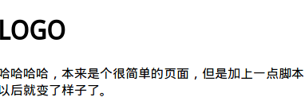
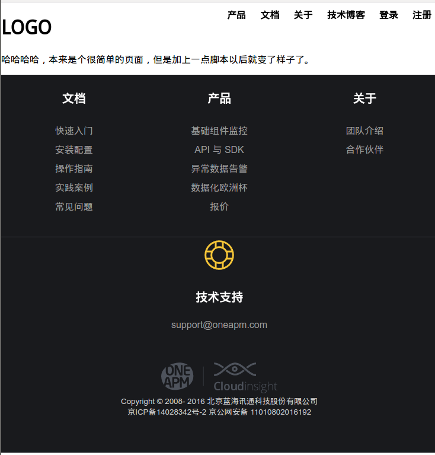

# sso

`Cloudinsight` 的单点登录插件, 只用在页面里引入改模块就可以显示跟登录相关的一些控件。

**引入前**



**引入后**



## 关于

- 栈格系统基于 `purecss`
- 使用了 `css-modules` 技术， 不会污染全局的 `css`
- 相关图片使用了 `data-url` 编码

## 使用

**需要哪个组件就在页面中引入就可以了**

| 文件                    | 对应组件                    |
|-------------------------|----------------------------|
| `dist/nav.js`           | 顶部快速跳转                |
| `dist/footer.js`        | 底部超链接                  |

## 本地开发

```sh
npm install
npm start
open http://127.0.0.1:8080/
```
